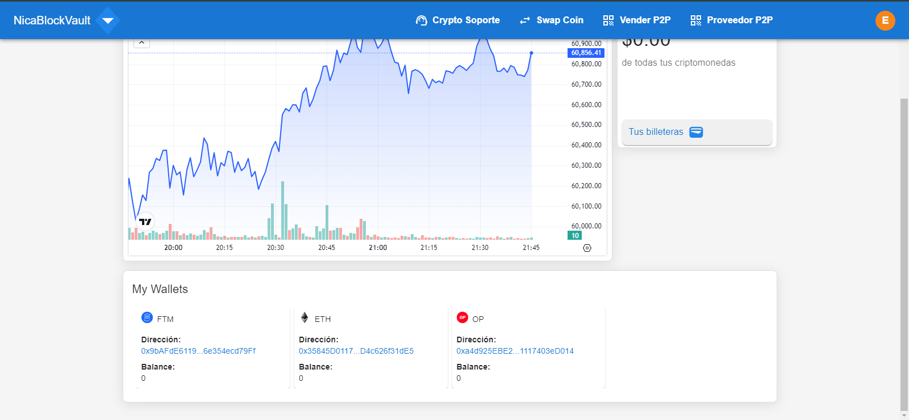
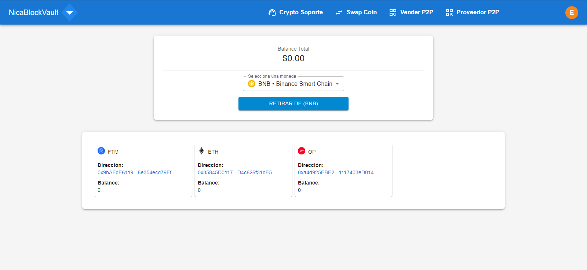
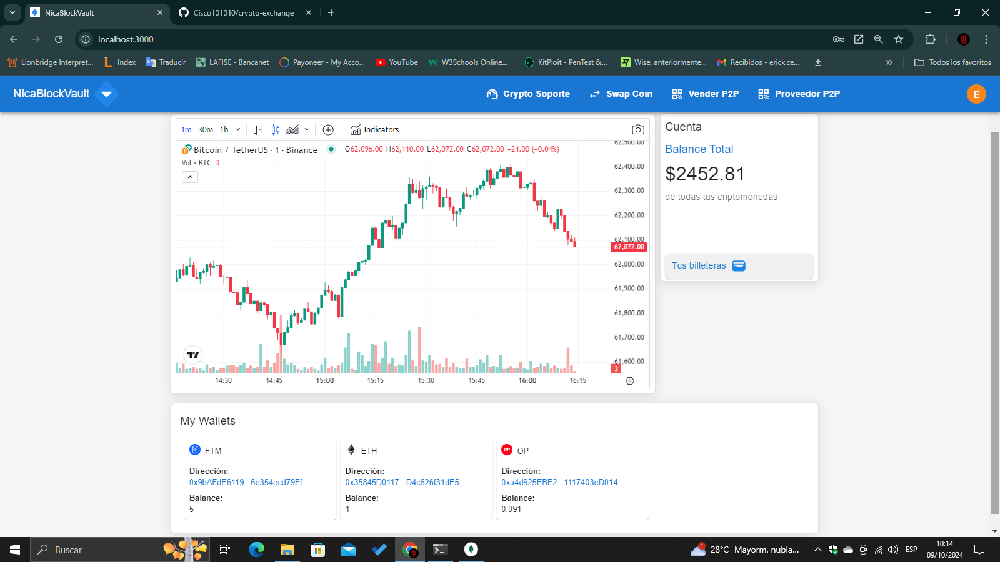
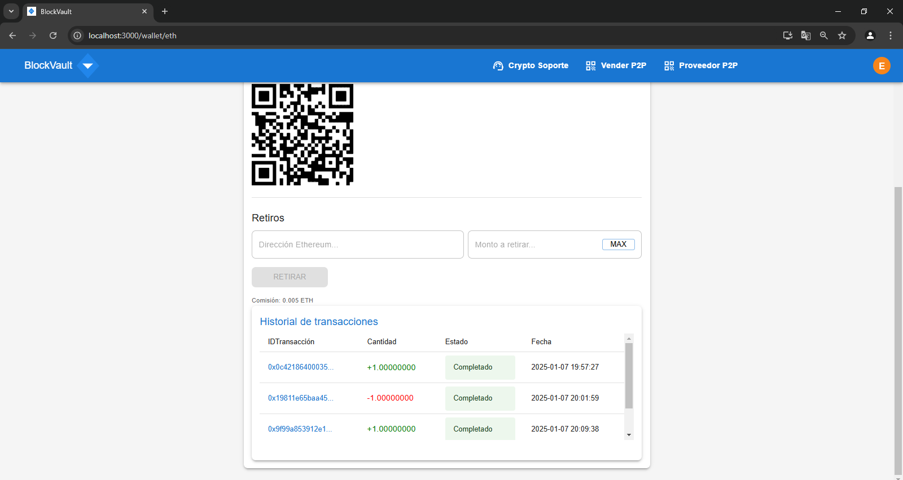

# NicBlockVault

## SETUP NODE ENV 
set NODE_OPTIONS=--openssl-legacy-provider

## START FRONTEND
cd frontend  
npm install  
npm start  

## INSTALL BACKEND DEPENDENCIES
cd backend  
npm install  
npm install -g pm2  
npm install -g solc  

## START APP-CORE
cd backend/app-core  
npm i -g @nestjs/cli  
npm install  
nest start --watch (listening mode)  
nest start  

## START DAEMONS
docker-compose up  
download redis server  
download mongo server  
redis-server  
mongod --port --  

## DEPLOY SMART CONTRACT AND GENERATE WALLETS
cd backend/tasks/  
npm install -g truffle  
truffle deploy --network (--network name--)  
node generate.js (--number of wallets--) + (--network ID--)  

# Licencia de Uso para NicBlockVault

## Estado del Proyecto
NicBlockVault es un proyecto de intercambio de criptomonedas que actualmente se encuentra en desarrollo. Agradecemos tu interés en este repositorio y estamos abiertos a colaboraciones.

## Clonación y Modificación
Si decides clonar o descargar este repositorio, por favor ten en cuenta lo siguiente:

1. **Cambios Requeridos**: Te pedimos que modifiques el diseño, el logo y los colores del proyecto original. Esto es para asegurar que tu versión del proyecto tenga una identidad única y diferenciada.

2. **Uso de Código**: Si bien puedes utilizar el código, te recomendamos que hagas las adaptaciones necesarias para que refleje tu propia visión y estilo.

3. **Reconocimiento**: Si decides lanzar tu propia versión, sería genial que reconozcas el trabajo realizado en este repositorio original.

## Colaboraciones
Estamos abiertos a colaboraciones. Si tienes ideas, mejoras o deseas contribuir al proyecto, envianos tu pull y la evaluaremos este directorio esta en actual desarrollo.

## Responsabilidad
El uso de este repositorio es bajo tu propio riesgo. No nos hacemos responsables de ningún problema que pueda surgir al utilizar el código o al operar el intercambio.

¡Gracias por tu comprensión y colaboración!

---

*NicBlockVault © 2024 Cibernet Systems*

### Screenshots
# Login

# Register

# 2FA Auth

 # Dashboard

# Dashboard wallets

# Wallets

# Home2

# Home3 

# Settings

# Transactions

# Transactions

