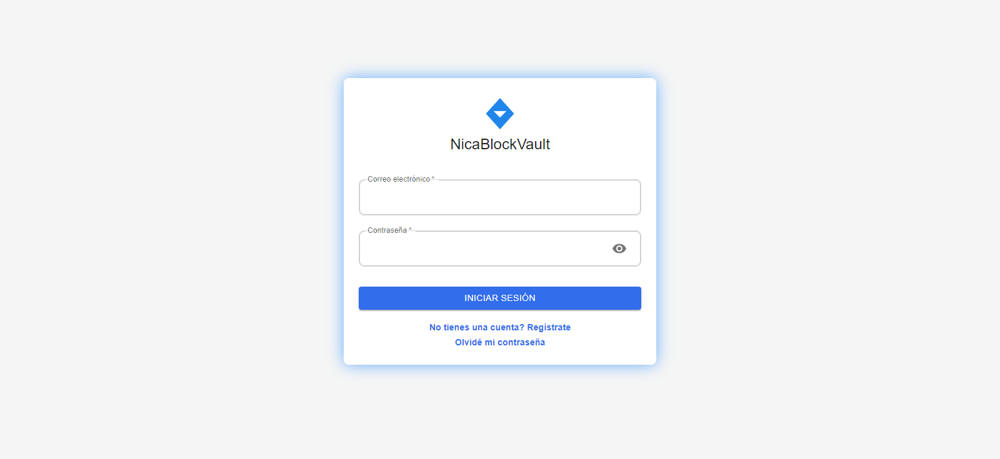
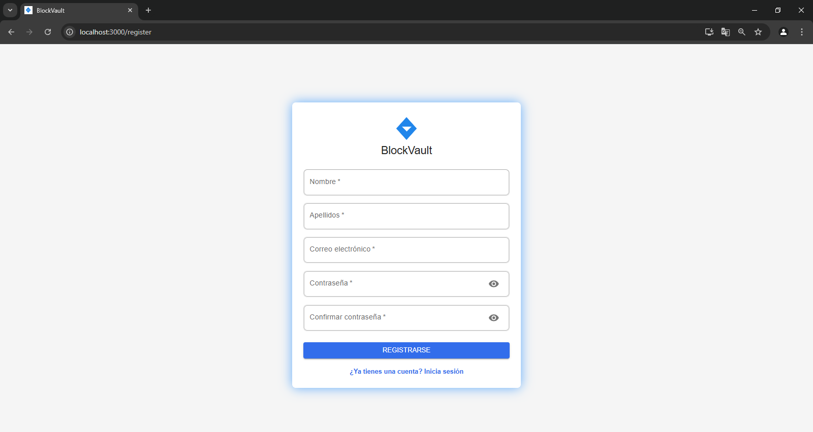
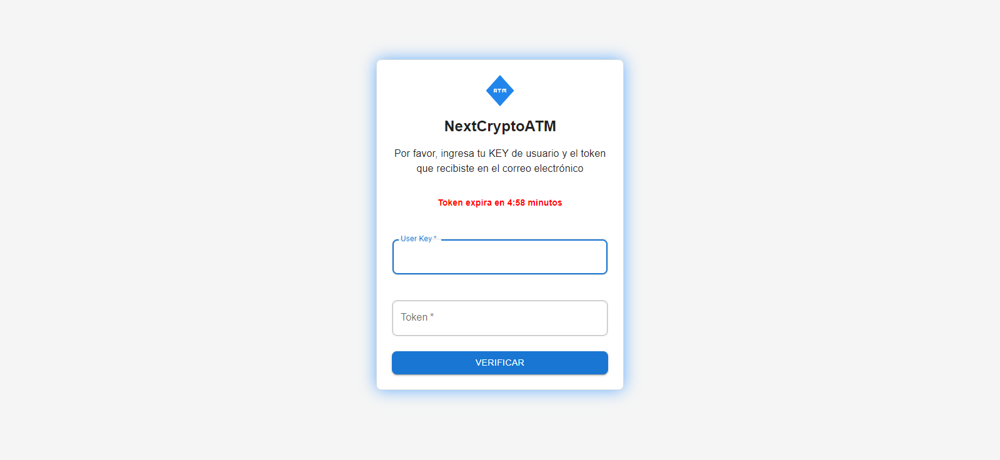
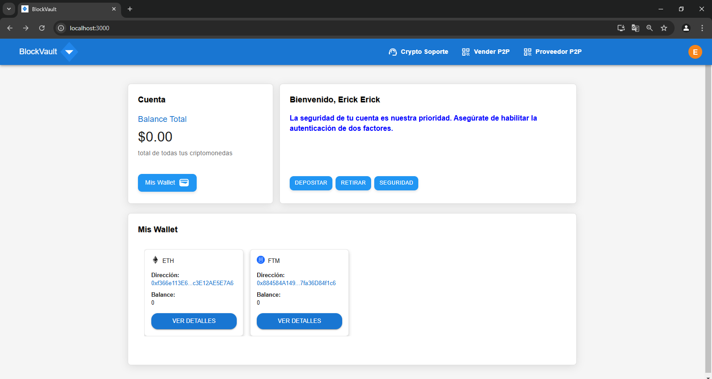
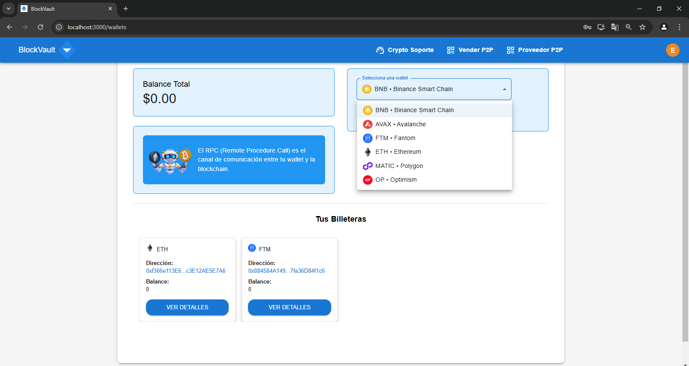
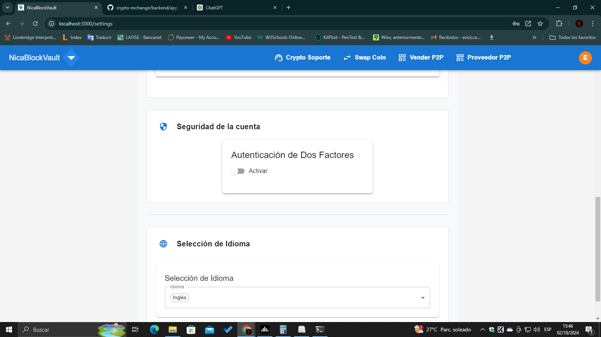
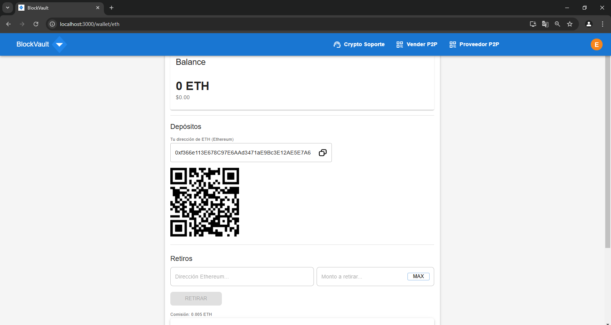
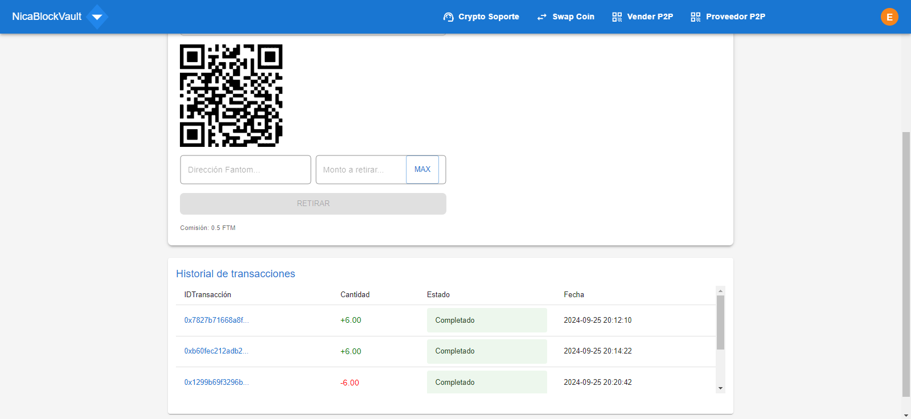
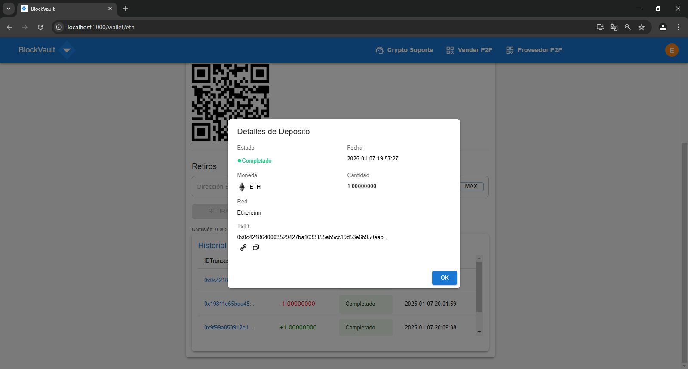

# BlockVault

## 🛠️ Technology Stack

## SETUP NODE ENV  
set NODE_OPTIONS=--openssl-legacy-provider  

## START FRONTEND  
cd frontend  
npm install  
npm start  

## INSTALL BACKEND DEPENDENCIES  
cd backend  
npm install  
npm install -g pm2  
npm install -g solc  

## START APP-CORE  
cd backend/app-core  
npm i -g @nestjs/cli  
npm install  
nest start --watch (listening mode)  
nest start  

## START DAEMONS AND WORKERS  
pm2 start process.json  
pm2 monit  
pm2 stop process.json  

## START INSTANCES  
docker-compose up  
download Redis server  
download MongoDB server  
redis-server  
mongod --port --  

## DEPLOY SMART CONTRACT AND GENERATE WALLETS  
cd backend/tasks/  
npm install -g truffle  
truffle deploy --network (--network name--)  
node generate.js (--number of wallets--) + (--network ID--)  

### Screenshots  

# Login  
  

# Register  
  

# 2FA Auth  
  

# Dashboard  
  

# Wallets  
  

# Settings  
  

# Transactions  
  

# Transactions History  
  

# Dashboard wallets  
  
